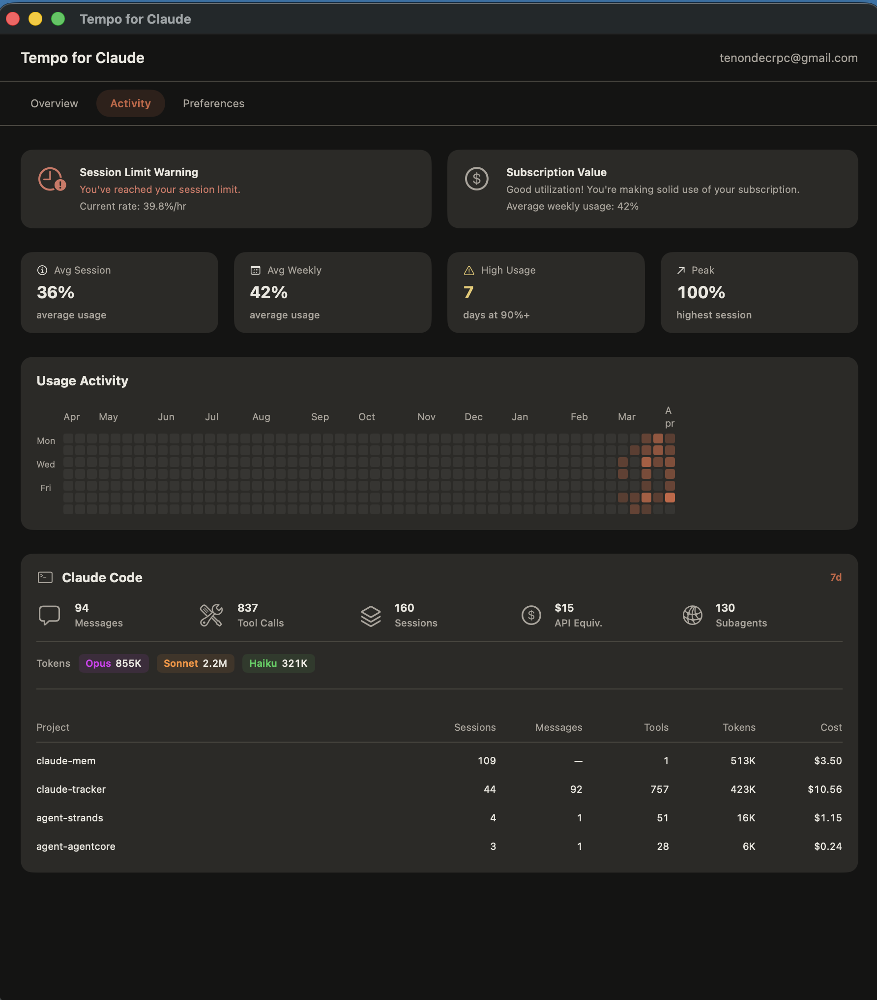
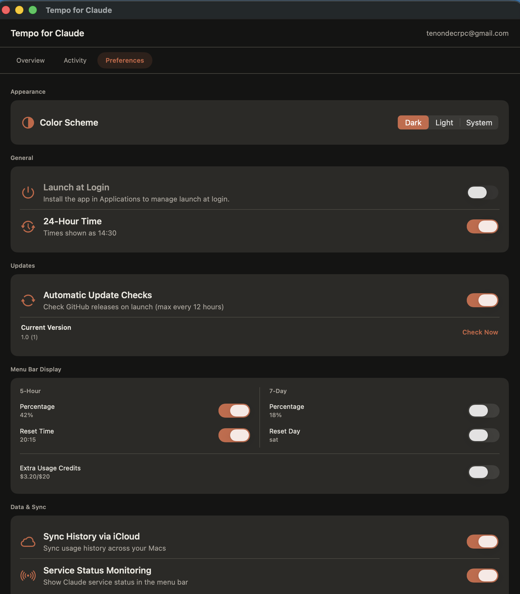
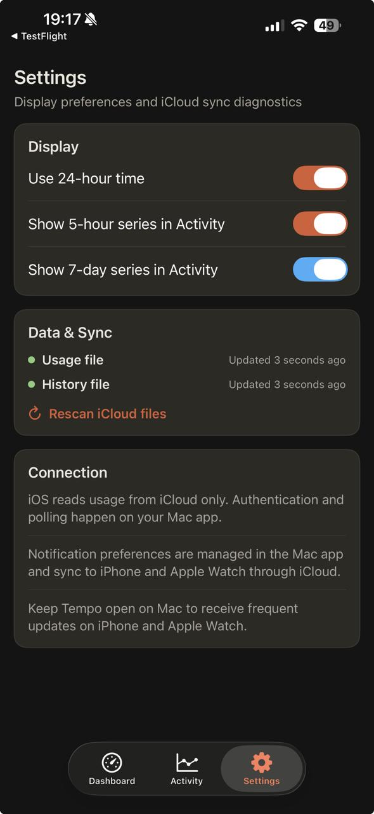
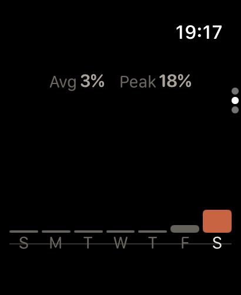
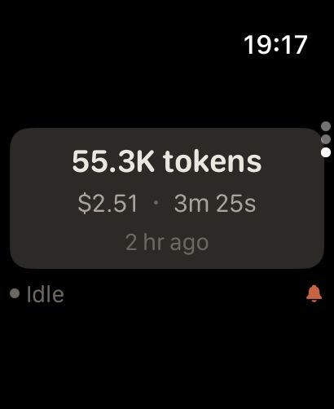

# Tempo for Claude

A macOS menu bar app that tracks your Claude Code token and credit usage in real time, with an Apple Watch companion for haptic alerts when a session ends. Supports multiple Anthropic accounts simultaneously - personal, work, or any combination.

[](https://github.com/tenondecrpc/tempo-for-claude/actions/workflows/build.yml)
[](https://github.com/tenondecrpc/tempo-for-claude/actions/workflows/codeql.yml)
[](https://github.com/tenondecrpc/tempo-for-claude/actions/workflows/dependency-review.yml)
[](LICENSE)

## Join the beta

Want early access to new Tempo builds? You can join the public beta on TestFlight here:

**[Join the Tempo beta on TestFlight](https://testflight.apple.com/join/1VJBBtVS)**

Install the app, try it on your devices, and send feedback while features are still evolving.

## Why this repo is trustworthy

- **CI on pull requests**: the macOS and iOS targets are built automatically in GitHub Actions for every PR.
- **Security checks**: Swift code is scanned with CodeQL, and dependency updates go through automated dependency review.
- **Maintainer review gates**: [`CODEOWNERS`](.github/CODEOWNERS) requires maintainer review for sensitive areas like workflows, project settings, entitlements, and app targets.
- **Structured contribution flow**: bug reports, feature requests, and PRs use templates with testing and risk checklists to keep changes reviewable.
- **Transparent data handling**: Tempo uses no custom backend; usage data stays on your Apple devices through iCloud sync.
- **Open license**: the project is released under the [`MIT License`](LICENSE), so the terms are explicit and easy to audit.

## Screenshots

### macOS menu bar

<p align="center">
  <a href="screenshots/mac-01.png">
    
  </a>
</p>

### macOS desktop windows

<p align="center">
  <a href="screenshots/mac-02.png">
    
  </a>
  <a href="screenshots/mac-03.png">
    
  </a>
  <a href="screenshots/mac-04.png">
    
  </a>
</p>

### iPhone companion app

<p align="center">
  <a href="screenshots/ios-01.jpeg">
    
  </a>
  <a href="screenshots/ios-02.jpeg">
    
  </a>
  <a href="screenshots/ios-03.jpeg">
    
  </a>
</p>

### Apple Watch

<p align="center">
  <a href="screenshots/watch_01.jpeg">
    
  </a>
  <a href="screenshots/watch_02.jpeg">
    
  </a>
  <a href="screenshots/watch_03.jpeg">
    
  </a>
</p>

## What it does

- Tracks **multiple Anthropic accounts** simultaneously (personal, work, etc.) - switch with one click
- Shows your **5-hour and 7-day utilization** as a ring gauge in the macOS menu bar
- Displays **burn rate**, extra usage, and next reset time at a glance
- Includes an iOS companion UI (**Dashboard**, **Activity**, **Settings**) styled with Claude tokens
- Shows **local Claude Code activity and project stats** in the macOS detail window
- Ships **widgets on macOS, iPhone, and Apple Watch**
- Delivers a **haptic alert on your Apple Watch** shortly after a Claude Code session ends
- Relays live usage data from macOS -> iCloud (per-account `usage.json`, `usage-history.json`) -> iOS -> Apple Watch

## Architecture

```text
macOS menu bar app
  |- Tempo OAuth / fresh Claude Code CLI fallback -> usage poller -> iCloud Drive (per-account usage.json / usage-history.json)
  |- Claude local session reader -> iCloud Drive (per-account latest.json)
  └- Local Claude stats -> macOS detail window

iOS companion (NSMetadataQuery + dashboard/activity/settings)
  └- WatchConnectivity (application context + transferUserInfo)
      └- watchOS alerts, trend, and usage surfaces
```

Two independent data pipelines run in parallel:

| Pipeline | Trigger | Data |
|---|---|---|
| **OAuth API** | 15-min poll | Utilization %, reset timestamps, usage history snapshots |
| **Claude local data** (`~/.claude/`) | 20-second poll | Session completion events, per-session tokens/duration, local activity stats |

The OAuth API is the authoritative source for utilization - the plan limit is account-specific and never exposed locally. Claude local data powers session completion alerts and richer local stats in the current repo.

Tempo stores its own OAuth credentials in Keychain and uses them as the preferred source for usage polling. A fresh Claude Code CLI access token may be used as a read-only fallback, but Tempo never refreshes, writes, or deletes Claude Code's own credentials. See [`docs/AUTH_FLOW.md`](docs/AUTH_FLOW.md) for the exact auth source order.

## Privacy and data handling

- Tempo does **not** run any custom backend and does **not** store your usage data on third-party servers.
- Data is synchronized only between your Apple devices through your iCloud container.
- iCloud sync and transport rely on Apple's security model and encryption standards.

## Multi-account

Tempo supports signing in to multiple Anthropic accounts at once (for example, personal and work, or parallel subscriptions). macOS is the only surface where accounts can be added or removed; iPhone, Apple Watch, and the widgets discover accounts automatically over iCloud and follow the account you pick as active.

### Adding accounts (macOS)

- Open the menu bar popover and click the Account row at the top.
- Pick `Add account...`. The Welcome window opens and runs the Anthropic OAuth flow.
- Repeat for each account you want to track. Accounts you have added show up under `Preferences > Accounts`.

The newly added account becomes the active one on macOS so you can confirm the sign-in worked.

### Switching the active account (macOS)

- Click the Account row in the popover and pick `Set as active: <email>`.
- The popover, the Stats detail window, and the macOS widget rebind to that account right away.

### Signing out (macOS)

- Open `Preferences > Accounts` and click `Sign out` on the account you want to remove.
- That account's Keychain slot is deleted and its iCloud data under `Tempo/accounts/<email>/` is removed.
- If the account you signed out of was active, Tempo promotes the next remaining account to active automatically.
- When you sign out of the last account, the Welcome window comes back so you can sign in again.

### iPhone

- Accounts appear on the iPhone automatically once macOS signs them in and iCloud finishes syncing. There is no add-account flow on iOS.
- The Dashboard shows an account chip at the top. Tap the chip to open the Accounts sheet and pick a different account; the Dashboard and the Activity tab rebind to that account and only show its data.
- The iPhone remembers the active account across relaunches. If you remove that account on macOS, the iPhone automatically falls back to another signed-in account.

### iPhone widgets

- Long-press a Tempo widget, pick `Edit Widget`, and use the `Account` picker to pin the widget to a specific account. Leave it unset to follow whichever account is active on the iPhone.
- If you remove a pinned account on macOS, the widget shows a small `Account removed` badge and falls back to the active account until you repin it.
- Tapping a widget pinned to a given account opens the iPhone app directly on that account.

### Apple Watch

- The watch always follows the iPhone's active account. There is no picker on the watch.
- When no account is signed in on any device, the watch shows a `No accounts available` placeholder telling you to use the Mac app.
- Session completion haptics only fire for the currently active account. A completion event for a different signed-in account is suppressed to keep the wrist honest.
- CLI-only sessions (sessions produced by Claude Code CLI under an account that is not signed in to Tempo) are exempt from that gate and can still fire a haptic; the completion sheet labels them as `CLI-only session`.

### Leftover iCloud files from earlier builds

If you used Tempo before multi-account, you may still see `Tempo/usage.json`, `Tempo/usage-history.json`, or `Tempo/latest.json` in iCloud Drive at the top level of the `Tempo/` folder. Tempo does not read those paths anymore; you can delete them from Finder whenever you like.

For the full developer-level layout (`Tempo/accounts/<email>/...`, `accounts/index.json`, Keychain keying), see [`docs/CONVENTIONS.md`](docs/CONVENTIONS.md).

## Targets

| Folder | Target | Role |
|---|---|---|
| `Tempo macOS/` | macOS menu bar app | OAuth sign-in, usage polling, iCloud writer |
| `Tempo/` | iOS companion app | iCloud reader, dashboard/activity/settings, WatchConnectivity sender |
| `Tempo Watch/` | watchOS app | Watch UI, haptics, local alerts, WatchConnectivity receiver |
| `Tempo macOS Widget/` | macOS widget extension | Desktop widgets backed by shared snapshots |
| `Tempo iOS Widget/` | iOS widget extension | iPhone widgets backed by shared snapshots |
| `Tempo Watch Widget/` | watchOS widget extension | Accessory widget surfaces |
| `Shared/` | Shared code | Data models, widget snapshots, routes, shared logic |

## Getting started

1. Open `Tempo.xcodeproj` in Xcode
2. Use a signing team that supports the committed iCloud container and widget app-group entitlements
3. Build and run the macOS target, then grant access to `~/.claude` when Tempo asks for local Claude Code stats
4. Sign in with your Claude account. Tempo first restores its own Keychain OAuth credentials, may use a fresh Claude Code CLI access token as a read-only fallback, and otherwise opens the OAuth browser flow for a paste-code sign-in.
5. Launch the iOS and watch targets on physical devices if you want live iCloud sync and WatchConnectivity verification

## Developer notes

### Leftover iCloud files from prior dev builds

The user-facing note under [`Multi-account > Leftover iCloud files from earlier builds`](#leftover-icloud-files-from-earlier-builds) applies to developers too, so we do not repeat it here. A few extra details for dev and test work:

- On macOS, the iCloud container lives at `~/Library/Mobile Documents/iCloud~com~tenondev~tempo~claude/Documents/Tempo/`.
- When debugging a fresh checkout against an existing container, any legacy `usage.json`, `usage-history.json`, or `latest.json` at the top level of that `Tempo/` folder is ignored by current builds. Deleting them prevents confusion while reading logs or inspecting files. Do not touch the `Tempo/accounts/` subtree.
- One-liner to remove the legacy files (Finder works too):

  ```sh
  rm -f ~/Library/Mobile\ Documents/iCloud~com~tenondev~tempo~claude/Documents/Tempo/usage.json \
        ~/Library/Mobile\ Documents/iCloud~com~tenondev~tempo~claude/Documents/Tempo/usage-history.json \
        ~/Library/Mobile\ Documents/iCloud~com~tenondev~tempo~claude/Documents/Tempo/latest.json
  ```

## Requirements

- macOS 13+ (menu bar app)
- iOS 16+ (companion app)
- watchOS 9+ (haptic alerts and usage ring)
- Apple Developer account (for iCloud Documents and widget/app-group entitlements on device)

## Roadmap

See [`docs/PLAN.md`](docs/PLAN.md) for the implementation roadmap and unscheduled backlog.

Current roadmap highlights:

- **Phase 6** - Reset alarm: strong haptic + notification at the exact moment your 5h limit resets
- **Phase 7** - QA and reliability hardening across macOS, iPhone, and Apple Watch
- **Phase 8** - Deeper stats surfaces and richer watch complications
- **Phase 9** - Context window tracking: usage gauge per active session with threshold alerts
